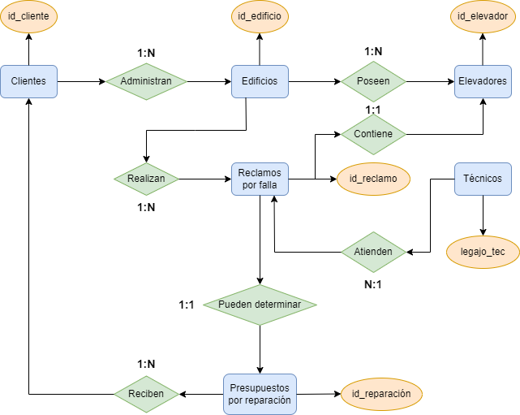
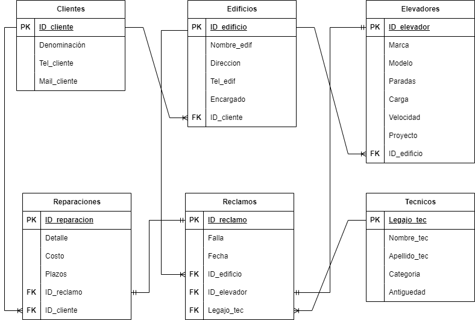
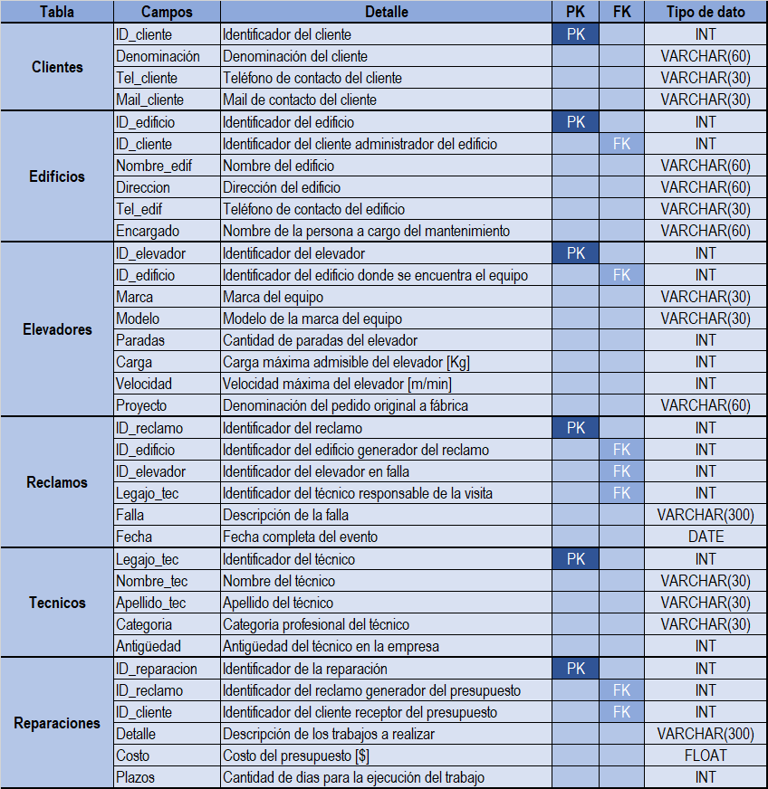

# Proyecto Coderhouse

Comisión: #57200

Alumno: Ferrand Nicolás

## Acerca del proyecto
- Tipo de negocio: Empresa dedicada al mantenimiento de elevadores.
- Situación problemática: Actualmente, no se encuentran ordenadas y conectadas las entidades intervinientes en el proceso de reclamos por falla y presupuestos por reparación.  
- Objetivo: Se busca vincular a todos los involucrados por el disparador común que es la generación de un reclamo ante la falla de uno de los equipos en servicio.

## Diagrama entidad-relación

## Diagrama esquemático

## Diagrama de tablas 

## Vistas
- reclamos_por_tec: ordena el listado de reclamos según el técnico encargado.
- edificios_ordenados: ordena el listado de edificios alfabéticamente.
- elevadores_Mitsu: muestra del listado de elevadores solo aquellos de marca Mitsubishi y ordenados por ID.
- reparaciones_urgencia: muestra el listado de reparaciones ordenado por el plazo de finalización desde la más urgente.

## Funciones
- total_deuda_cliente: recibe el ID_cliente y devuelve el costo total adeudado por reparaciones.
- total_reclamos_edificio: recibe el ID_edificio y devuelve la cantidad de reclamos recibidos de ese edificio.

## Stored Procedures
- ordenar_reclamos: devuelve la lista ordenada de reclamos según el parámetro que recibe.
- porcentaje_reclamos_edificio: recibe el ID_edificio y calcula que porcentaje de reclamos de este edificio existieron sobre el total de los reclamos recibidos.

## Triggers
- Se crea una tabla log_tecnicos que almacena los cambios en la tabla tecnicos, ya sea por:
-- INSERCION: tr_insert_tecnicos.
-- UPDATE: tr_update_tecnicos.
-- DELETE: tr_delete_tecnicos.